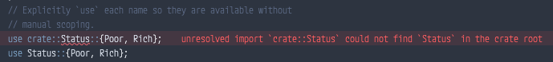

- [Format](#format)
- [Rust Compiler Error Index](#rust-compiler-error-index)
  - [E0432](#e0432)
- [Rust by Example](#rust-by-example)
  - [3. Custom Types](#3-custom-types)
    - [Enums](#enums)
      - [use](#use)
        - [match](#match)
      - [C-like](#c-like)
      - [Testcase:linked-list](#testcaselinked-list)
    - [Constants](#constants)
  - [4. Variable Bindings](#4-variable-bindings)
      - [Mutability](#mutability)
      - [Scope and Shadowing](#scope-and-shadowing)
      - [Declare first](#declare-first)
  - [5. Types](#5-types)

## Format

https://github.com/rust-lang/rustfmt

[VSCodeでRustコードをフォーマット](https://minerva.mamansoft.net/VSCode/VSCode%E3%81%A7Rust%E3%82%B3%E3%83%BC%E3%83%89%E3%82%92%E3%83%95%E3%82%A9%E3%83%BC%E3%83%9E%E3%83%83%E3%83%88)

フォーマッターをブチこんでフォーマットするのかと持ったら普通にprettierで動くみたい

## Rust Compiler Error Index

[Rust Compiler Error Index](https://doc.rust-lang.org/error-index.html)

エラーが網羅されている素敵なページを見つけてしまった

### [E0432](https://doc.rust-lang.org/error-index.html#E0432)


## Rust by Example

### 3. Custom Types

#### Enums

列挙型というらしい。

正直いまんところ使う恩恵があんまりわかんない

[例によると](https://doc.rust-lang.org/rust-by-example/custom_types/enum.html#type-aliases)impleブロック内でselfという別名を使用する場合に嬉しいらしい(ドキュメントそんまま)

##### use



載っているexampleの通り行うとなんか怒られる

> could not find `Status` in the crate root rustc(E0432)

[Rustのモジュールの使い方 2018 Edition版](https://keens.github.io/blog/2018/12/08/rustnomoju_runotsukaikata_2018_editionhan/)

モジュールのときに使用する感じかなぁ

ファイルの中にインラインで作る方法は使われない…まぁそりゃそんな感じだよねって気がする

> `use`を使用すれば変数のスコープを絶対名で指定する必要がなくなる。

あ〜絶対名で指定する必要がなくなるのかこれ、だからモジュールのあれこれでやるのか。

###### match

これ便利そう。switch-case的な挙動をするのかな

```rust
match varName {
  valueA => ...
  valueB => ...
}
```

おそらくこんな感じの書き方。返り値のところには関数も多分行ける。

##### C-like

~~もともとcの書き方とか忘れちゃったからなぁ…~~

値を明記しない場合、整数で0から入ってくれるみたい。便利だね。

しれっと使ってるけど型のキャストは`as`みたい。それっぽく使えて便利だね。

##### Testcase:linked-list

昔触ったことありそうなリストだ…

`enum List`が次のリストのポインタを持つか、終端であることを示す値を持つかで`enum`が適切なのね…

> ```rust
> // このメソッドは、`self`の状態によって振る舞いが
> // 変化するため、matchをする必要がある。
> // `self`の型は`&List`であるので、`*self`は`List`になる。マッチングは
>// リファレンス(`&T`)ではなく実体(`T`)に対して行うのが好ましい。
>  match *self {
>  // `self`をすでに借用しているので、tailの所有権を取ることができない。
> 
>  // 代わりに参照を使用する。
>   Cons(_, ref tail) => 1 + tail.len(),
>  // 空リストならば長さは0
>   Nil => 0,
>}
> ```

むちゃくちゃポインタの話ししてて頭が痛くなりそうである。

selfを参照して、あったらlength、終端だったら0って感じ

う〜〜〜んなんだか嬉しいのか嬉しいのかよくわからない使用例ッッ

#### Constants

JSでもおなじみな`const`くんと`static`くん

> - `const`: An unchangeable value (the common case).
> - `static`: A possibly `mut`able variable with [`'static`](https://doc.rust-lang.org/rust-by-example/scope/lifetime/static_lifetime.html) lifetime. The static lifetime is inferred and does not have to be specified. Accessing or modifying a mutable static variable is [`unsafe`](https://doc.rust-lang.org/rust-by-example/unsafe.html).

あんまり言うこともないし~~深堀りする気も正直ない~~

### 4. Variable Bindings

> 値（リテラルなど）は`let`を用いて変数に束縛することができます。

```rust
let noisy_unused_variable = 2u32;
// FIXME ^ Prefix with an underscore to suppress the warning
```

先頭にアンダースコアをつけた変数はwarningを無視できるらしい

##### Mutability

変更可能な変数にするには明示しなければいけないらしい

型安全…

##### Scope and Shadowing

ブロックが`{}`で定義されるあたり超シンプル

使えるのかな…？変数の名前被りとかが存在したときに…とかパッと思いついたけどそれは設計に問題があるのでは…？ボブは訝しんだ

てかひょっとして再宣言ってshadowingっていうの…！？英語学習みたいだな…

##### Declare first

宣言と初期化が別々でできるぞ！

マジでcっぽい、懐かしい

てか今ふと思ったのは、値の右に変数の型をくっつけて記述する方法が非常に気持ち悪い。TSみたいに変数名の後にぴゃっとつける方が好みかなぁ

```rust
let mut _mutable_integer: i32 = 7;
```

### 5. Types

#### Casting

`as`でキャストできるのPython？みたいでなんかノリでできそうなので省略

でもよく考えたらまずキャストしないようなコードを書くように心がけよう

#### Literals

数値型リテラルとかほにゃほにゃ…

これどっかでお話した気もするので省略(やる気あるんか？)

#### Inference

例の通りやってみたら、型推論をテストするはずなのに型が無いぞアホ！！！って怒らりた…

まぁ型を付けられるのが嬉しいのに、その型を無視するような型推論は許さんぞ！ってことなのかな。ありがとうvscodeくん。

#### Alias

> その場合、名前は`UpperCamelCase`でなくてはなりません。さもなくばコンパイラがエラーを出します。

さもなくば、好き

tsでいうtypeとかinterfaceみたいなものなのかなみたい思っている。

dictionaryみたいな型があればめっちゃ便利なんだろうけど、後々出るやろきっと…

