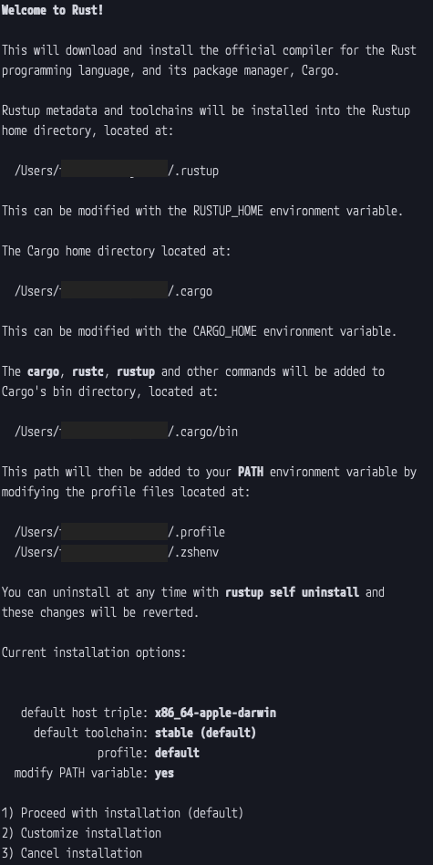

# 1200RustWeeklyMemo

- [1200RustWeeklyMemo](#1200rustweeklymemo)
  - [Why I learn a rust?](#why-i-learn-a-rust)
  - [Instllation for Rust](#instllation-for-rust)
  - [Print Hello World and additional tutorial](#print-hello-world-and-additional-tutorial)
  - [Rust By Example](#rust-by-example)
    - [1. Hello World](#1-hello-world)
      - [Comments](#comments)
      - [Formatted print](#formatted-print)
        - [Rustc vs Cargo run](#rustc-vs-cargo-run)
        - [ファイルのインポート](#ファイルのインポート)
      - [Debug](#debug)
        - [What's Derive?](#whats-derive)
      - [Display](#display)
        - [Struct](#struct)
        - [Write](#write)
      - [Formatting](#formatting)
    - [2. Primitives](#2-primitives)
      - [Literals and opetators](#literals-and-opetators)
      - [Tuples](#tuples)
        - [Function](#function)
      - [Arrays and Slices](#arrays-and-slices)
    - [3. Custom Types](#3-custom-types)

## Why I learn a rust?

2021年も終わりということで今年を振り返り、社会人になっても「何も成長していない…」と感じたので、あれこれ勉強しようと思い立った。

最初はGoでも勉強しようかな…とか思ってたんですが、どうにも調べたところRustが台頭してきている様子。

GoとRustの比較記事とか色々見たんですが、どうにもこうにも競っている土俵がそもそも違う感じが。

んでもってGoよりRustのほうが低レイヤーで動くし早いしメモリは管理できて嬉しいみたいなので、Rustのほうが伸びるという意見を信じてとりあえず触ってみようと思う。

## Instllation for Rust

[Rust をインストール](https://www.rust-lang.org/ja/tools/install)



なんかもにょもにょ言われた

よく見たらパスが`.profile`と`.zshrc`にしかないみたいなのでfishにもパスをぶち通さないといけないっぽい

[Rustをインストール - macOS & fish-shellの場合](https://qiita.com/ledsun/items/9af5cb594b4f9b6c5523)

毎度fishでエイリアスとか環境変数の通し方を忘れてしまう………

### **あとから追記**

冷静に考えたらhomebrewで入れたほうが後々管理が楽かなとおもってぶち消して入れ直した

[rustupのアンインストール方法](https://yuzu441.hateblo.jp/entry/2017/03/22/201027)

> ```sh
> rustup self uninstall
> ```

### **さらに後から追記**

vscodeのrustの拡張機能を入れようとしたところrustupがないぞ！って怒られてた

`brew install rustup-init`をぶっ叩く

vscodeでrustの拡張機能を入れて設定でパスを通して出来上がり！！

## Print Hello World and additional tutorial

[新しいプロジェクトを作成する](https://www.rust-lang.org/ja/learn/get-started#:~:text=GEANY-,%E6%96%B0%E3%81%97%E3%81%84%E3%83%97%E3%83%AD%E3%82%B8%E3%82%A7%E3%82%AF%E3%83%88%E3%82%92%E4%BD%9C%E6%88%90%E3%81%99%E3%82%8B,-%E6%96%B0%E3%81%97%E3%81%84Rust%E9%96%8B%E7%99%BA)

かなりさらっといけました

> Rustではパッケージのことをよく「クレート」と呼びます。

これ慣れるまで非常に混乱しそう…

チュートリアルに従ってカニを喋らせた。

>  フェリスはRustコミュニティの非公式マスコットです。多くのRustプログラマは自身のことを「Rustacean」と呼びますが、これは[crustacean](https://en.wikipedia.org/wiki/Crustacean)の言葉遊びから来ています。私たちはフェリスを指し示すのに、性別を表す代名詞の代わりに「they」や「them」などの代名詞を使います。
>
> フェリスは、鉄もしくは鉄に関連することを意味する「ferrous」という形容詞に由来する名前です。錆び（Rust）は鉄の上にできることが多いので、マスコットの名前の起源として面白いですね！

## Rust By Example

> ひとつの言語について何百ページも読むのがあなたの好みに合わなければ、 Rust By Exampleにお任せください。the bookはコードをたくさんの言葉で説明しますが、 RBE (Rust By Example)はたくさんのコード例を示し、説明は最小限です。練習問題もあります！

…らしく、見た感じ一番手っ取り早く触れると思った(悪い癖…)

[Rust by Example](https://doc.rust-lang.org/stable/rust-by-example/)

### 1. Hello World

#### Comments

`///`とか`//!`は[ドキュメント](https://doc.rust-lang.org/stable/rust-by-example/meta/doc.html)にてマークダウンをサポートするらしい。便利だね。

とかいってもこれを使う機会はそうそうなさそうなので知識として頭の片隅に置いておく程度かも。

コメントに関しては結構一般的なコメントアウトと一緒。ノリで使えます。

#### Formatted print

```rust
println!("{0}, this is {1}. {1}, this is {0}", "Alice", "Bob");
```

そこはかとないpythonみを感じる

> - `format!`: write formatted text to [`String`](https://doc.rust-lang.org/stable/rust-by-example/std/str.html)
> - `print!`: same as `format!` but the text is printed to the console (io::stdout).
> - `println!`: same as `print!` but a newline is appended.
> - `eprint!`: same as `format!` but the text is printed to the standard error (io::stderr).
> - `eprintln!`: same as `eprint!`but a newline is appended.

まぁまぁ、printlnをメインで使うんだろうなぁと思って他のものはこんなもんもあるんだなぁ程度に見ておく

> - `fmt::Debug`: Uses the `{:?}` marker. Format text for debugging purposes.
> - `fmt::Display`: Uses the `{}` marker. Format text in a more elegant, user friendly fashion.

デバッグ用にプリントするときはこれなのかな

##### Rustc vs Cargo run

一旦ここで湧き出た疑問が`rustc`と`cargo run`の二種類が出てきてるぞ？みたいなところ気になった

rustcがコンパイルして実行ファイルを生成して、cargo runのほうはコンパイルして実行ファイルを直接実行してしまってファイルには残さないみたいな印象がある(予想)

[Rustお勉強 No.1 〜Hello Worldまで〜](https://zenn.dev/mjinno/articles/4db0f1d37e85ee0828f5#rustc-%E3%82%B3%E3%83%9E%E3%83%B3%E3%83%89)

[習慣としてのCargo](https://doc.rust-jp.rs/book-ja/ch01-03-hello-cargo.html#習慣としてのcargo)

> になるにつれて、 その価値を証明するでしょう。複数のクレートからなる複雑なプロジェクトでは、Cargoにビルドを調整してもらうのが遥かに簡単です。
>
> `hello_cargo`プロジェクトは単純ではありますが、今では、Rustのキャリアを通じて使用するであろう本物のツールを多く使用するようになりました。 事実、既存のどんなプロジェクトに取り組むにも、以下のコマンドを使用して、Gitでコードをチェックアウトし、 そのプロジェクトのディレクトリに移動し、ビルドできます:

cargoは非常に便利ツールみたいな感じがするのでこちらメインで使っていこう。

##### ファイルのインポート

気になったのがドカっと多くのファイル作ってmainから呼び出すようにして実験していきたいなとか考えた。

…そうなってくるとファイルのインポートが気になってくる

[Rustでのimport文の書き方](https://qiita.com/MCUYvSCY8E/items/01ddfc8393ddb9d03dfe)

```rust
use directory_name::file_name
```

ここわからんくて躓いた

これ考えるとファイル名は全部アンダースコアで命名した方が良いな…

#### Debug

**デバッグの章あるやんけ！**

> So `fmt::Debug` definitely makes this printable but sacrifices some elegance. Rust also provides "pretty printing" with `{:#?}`.

これ、オブジェクトを整形して表示してくれる様子。

```rust
// これは整形して表示される
println!("{{:#?}} is {:#?}", peter);

// これは成形されず表示される
println!("{{:?}} is {:?}", peter);

// これは無理
println!("{{}} is {}", peter);
```

オブジェクト(呼び方合っているかどうかはいまんところわからない)をそのまま表示しようとするとエラーが出る。displayを強く見積もりすぎた。

##### What's Derive?

Deriveって何ーーーーーっ！？

derive: 引き出す、得る、由来を尋ねる....

[日本語ドキュメント](https://doc.rust-jp.rs/rust-by-example-ja/trait/derive.html)(あったんだ…)見たら継承って書かれてた

言語の標準モジュールをインポートしてくる文みたいな捉え方しておこ

#### Display

そんなに言うことはない

console.logくらいに万能ではなく全部の型に対応しているわけではないので困ったらdebugのフォーマットをを使おう

##### Struct

```rust
struct PointComplexPlane {
    real: f64,
    imag: f64,
}
```

> - Tuple structs, which are, basically, named tuples.
> - The classic [C structs](https://en.wikipedia.org/wiki/Struct_(C_programming_language))
> - Unit structs, which are field-less, are useful for generics.

ヴっ……C言語の構造体とか記憶がない……

##### Write

> Implementing `fmt::Display` for a structure where the elements must each be handled sequentially is tricky. The problem is that each `write!` generates a `fmt::Result`. Proper handling of this requires dealing with *all* the results. Rust provides the `?` operator for exactly this purpose.
>
> Using `?` on `write!` looks like this:
>
> ```rust
> // Try `write!` to see if it errors. If it errors, return
> // the error. Otherwise continue.
> write!(f, "{}", value)?;
> ```
>
> With `?` available, implementing `fmt::Display` for a `Vec` is straightforward:

?を末尾につければreturnすること無くwriteし続けることができる的な漢字かな？

[公式ドキュメントのDisplay::List](https://doc.rust-lang.org/stable/rust-by-example/hello/print/print_display/testcase_list.html#testcase-list)も例として同じことをやっている様子。

#### Formatting

[参考 [Rust] 文字列のフォーマット指定（println! / format!）](https://qiita.com/YusukeHosonuma/items/13142ab1518ccab425f4#fmtdisplay--fmtdebug)

> - `{}` では `fmt::Display` の実装が使われ
> - `{:?}` では `fmt::Debug` の実装が使われる

このへんでフッと腑に落ちた

```rust
impl Display for City {
    // `f` is a buffer, and this method must write the formatted string into it
    fn fmt(&self, f: &mut Formatter) -> fmt::Result {
        let lat_c = if self.lat >= 0.0 { 'N' } else { 'S' };
        let lon_c = if self.lon >= 0.0 { 'E' } else { 'W' 
        // `write!` is like `format!`, but it will write the formatted string
        // into a buffer (the first argument)
        write!(f, "{}: {:.3}°{} {:.3}°{}",
            self.name, self.lat.abs(), lat_c, self.lon.abs(), lon_c)
    }
}
```

構造体のdisplayとかを設定できるみたい

write!がreturn文のようなものだと思っている

### 2. Primitives

> ### [Scalar Types](https://doc.rust-lang.org/stable/rust-by-example/primitives.html#scalar-types)
>
> - signed integers: `i8`, `i16`, `i32`, `i64`, `i128` and `isize` (pointer size)
> - unsigned integers: `u8`, `u16`, `u32`, `u64`, `u128` and `usize` (pointer size)
> - floating point: `f32`, `f64`
> - `char` Unicode scalar values like `'a'`, `'α'` and `'∞'` (4 bytes each)
> - `bool` either `true` or `false`
> - and the unit type `()`, whose only possible value is an empty tuple: `()`
>
> ### [Compound Types](https://doc.rust-lang.org/stable/rust-by-example/primitives.html#compound-types)
>
> - arrays like `[1, 2, 3]`
> - tuples like `(1, true)`

ある程度なら型推論してくれて弾いてくれるみたい

でもミュータブルとはいえども型は不変 仕方ないね

#### Literals and opetators

別段言うことはない

明示してあげたほうが安全な気がする

> Underscores can be inserted in numeric literals to improve readability, e.g. `1_000` is the same as `1000`, and `0.000_001` is the same as `0.000001`.

これは便利そう

#### Tuples

もはや感覚的に配列みたいな捉え方をしてしまっている…(もちろんタプルという概念なんだろうけども)

型はなんでもブチ込めるみたいな

```rust
// Tuples can be tuple members
let tuple_of_tuples = ((1u8, 2u16, 2u32), (4u64, -1i8), -2i16);

// Tuples are printable
println!("tuple of tuples: {:?}", tuple_of_tuples);
    
// But long Tuples cannot be printed
// let too_long_tuple = (1, 2, 3, 4, 5, 6, 7, 8, 9, 10, 11, 12, 13);
// println!("too long tuple: {:?}", too_long_tuple);
// TODO ^ Uncomment the above 2 lines to see the compiler error
```

んだそりゃあ……

##### Function

```rust
fn transpose(matrix: Matrix) -> Matrix {
    let new_matrix: Matrix = matrix;
    Matrix(new_matrix.0, new_matrix.2, new_matrix.1, new_matrix.3)
}
```

すげぇぬるっと関数が出てきている

型についてはTSみたいなノリで書いてなんとかなってそうなのでもう一度出てきた時に確認するべし

#### Arrays and Slices

**Arrayあるんかい！！**

> Slices are similar to arrays, but their length is not known at compile time. Instead, a slice is a two-word object, **the first word is a pointer to the data, and the second word is the length of the slice.** The word size is the same as usize, determined by the processor architecture eg 64 bits on an x86-64. Slices can be used to borrow a section of an array, and have the type signature `&[T]`.

ヴっ………ポインタ……頭がッ……！

### 3. Custom Types

#### Structures

普通に[ここ](#struct)で触れてたな…Cの構造体と一緒な感じっぽい
